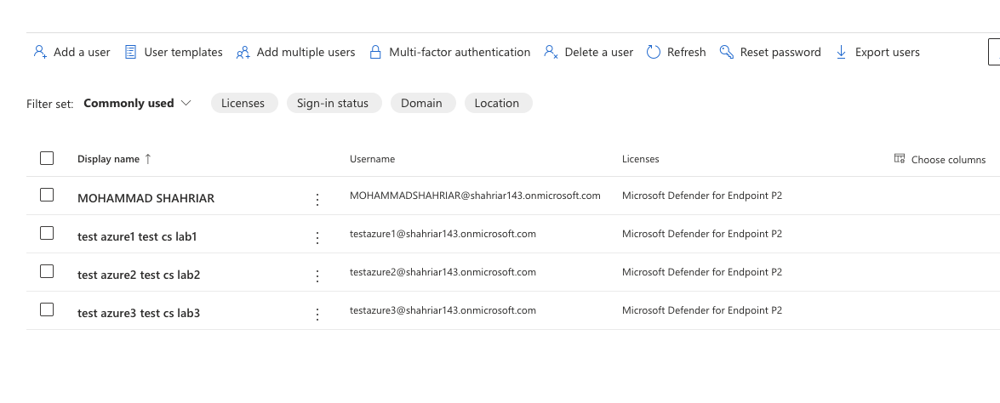

# Azure M365 Defender Security Lab – Free Tier Edition

## Objective

Learn core cybersecurity skills using **Microsoft 365 Defender**, **Azure IAM**, and **Microsoft Sentinel**, all using free-tier tools.

## Tools Used

- Microsoft 365 Defender (via Dev Program)
- Azure AD Free Tier
- Microsoft Sentinel (free log ingestion)
- Compliance Center

# SetUp MS 365 Defender
1)Microsoft 365 Defender
2)25 dummy users

# Create Dummy/Test Users in Microsoft 365 Admin Center
✅ Pre-Requisite
We must need Admin Access to your Microsoft 365 tenant.

🔹 Step 1: Go to Microsoft 365 Admin Center
Open your browser and go to 👉 https://admin.microsoft.com

Log in using our Admin email and password

🔹 Step 2: Navigate to 'Users'
In the left-side menu, click on Users

Then select Active users

🔹 Step 3: Add a New User
Click the “+ Add a user” button near the top

*) User#1 Details:
Display name: test azure1 test cs lab1
Username: testazure1@cyberlab1234.onmicrosoft.com
Password: F&443690147500am/ ****d!

*) User#2 Details:
Display name: test azure2 test cs lab2
Username: testazure2@cyberlab1234.onmicrosoft.com
Password: P@439209892725am / ****d!

*) User#3 Details:
Display name: test azure3 test cs lab3
Username: testazure3@cyberlab1234.onmicrosoft.com
Password: R#838964183493an

*)Regular user:
Username: qatester@cyberlab1234.onmicrosoft.com
password: *****d!

Admin User:
Display name: admin
Username: admin@cyberlab1234.onmicrosoft.com
Password: W(643891120169os / ***d!

# Launch a Phishing Simulation Campaign

In Microsoft Defender’s Attack Simulation Training, "Phishing" is the general category — but when you go into the simulation setup, it offers specific attack techniques that simulate different types of phishing attacks.

🎯 What We are Seeing = Phishing Techniques (Subtypes)
Here’s what each option means:

Credential Harvest	Sends a fake login page to steal usernames/passwords	✅ Yes	✅ Best option for beginner simulation
Malware Attachment	Sends a malicious file as an attachment	✅ Yes	Good for advanced cases
Link in Attachment	Email has an attachment that contains a malicious link	✅ Yes	
Link to Malware	A link in the email directly downloads malware	✅ Yes	
Drive-by URL	A link that silently tries to exploit the browser	✅ Yes	
OAuth Consent Grant	Tricks user into giving access to apps via OAuth	✅ Yes	
How-to Guide	Just an informational help guide (not a technique)	❌ No	Just for reference

✅ Best Option for My Assignment
Select:
🔹 Credential Harvest

Why?
It simulates a fake login page (like Outlook or Microsoft login)

It's the most common phishing method

Easy to track: users click the link → enter dummy credentials → results show up in your dashboard

📌 What to Do Now:
Select Credential Harvest

Click Next

Continue the rest of the simulation setup:

Name the simulation

Choose a payload/template (e.g., fake Microsoft login)

Select your test users (like AdeleV, MiriamG)

# Adding my Target Users

Now, 
# Select Phishing Landing Page

# Choose Launch now / Send a test

# Now Send test email and login as those test users

# Submit

✅ What Happened After Submission
The phishing simulation is scheduled to:

Start: June 10, 2025, at 2:03 AM

Targets: 3 users

✅ Technique: Credential Harvest

✅ Status: Scheduled

🕒 What Happens Next
Within a few minutes (or at the scheduled time), each of the target users will receive a phishing email (e.g., a fake Microsoft login or password alert).

👣 What We Should Do Next
🔹 Step 1: Log in as One of the Test Users 
Pick one of the test users you targeted. Example:

( logged in as Test Azure1 test CS Lab1)

How to Log In:
Lets Go to 👉 https://outlook.office.com

Enter the user’s email and password

Open their inbox

Look for the phishing simulation email

Click the phishing link

🔹 Step 2: Go Back to Admin Dashboard and Track
Go to: https://security.microsoft.com/attacksimulator

Click on your campaign name ( Phishing )

We’ll see:

✅ Who clicked the link

✅ Who submitted credentials

✅ Whether Microsoft Defender detected the attack

✅ If auto-remediation actions (like email removal) were taken

# ----------------------------------------------------------------------------------------------------

# 4: Configure IAM (Identity and Access Management) with Azure AD Free

🎯 Goal:
Set up IAM (Identity and Access Management) using Azure Active Directory (Azure AD Free). This includes:

Creating user groups like SOC Analyst and IT Admin

Assigning RBAC (Role-Based Access Control) using built-in roles

Setting up a Conditional Access policy (e.g., IP/location restriction)

🛠️ Prerequisites:
Before starting, we have to make sure:

We’re signed in as the Global Administrator (the admin account you created earlier — e.g., admin@yourlab1234.onmicrosoft.com)

You have access to the Azure Portal: https://portal.azure.com

🧭 Step-by-Step Instructions
🔹 Step 1: Go to Azure Active Directory
Open browser and go to 👉 https://portal.azure.com

Sign in with your admin credentials

In the left-side menu, click on “Azure Active Directory”

✅ You're now in the Azure AD control center

